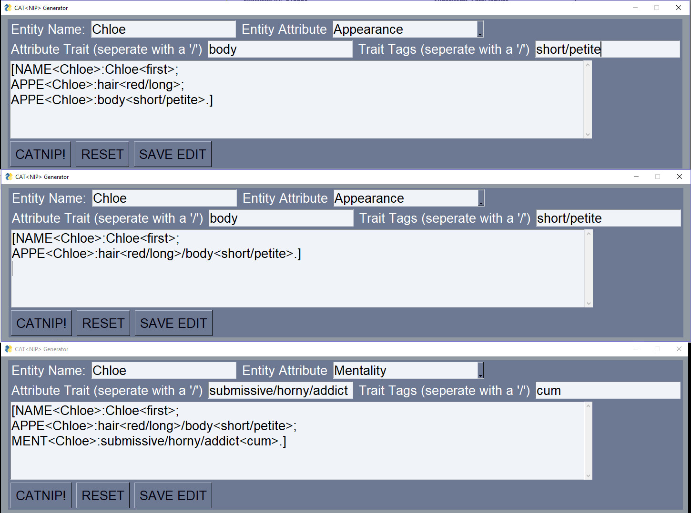

# CAT&lt;nip> Formater

This is a CAT&lt;nip> formating tool for AI Dungeon. This formating method was created by Curious Nekomimi. 

## What is CAT&lt;nip>
CAT&lt;nip> is a code format for entities in AI Dungeon. It allows AI dungeon to "rememeber" things about a character with greater accuracy. Below is a sample breakdown of CAT&lt;nip>.

## WIP
This code is a work in progress

## How to use it
Fill in the blanks with the information you want to convert into the CATNIP format, example below.

## Features to add

### Add catches for bad data
Certain types of repeated data will trip up the formater, this needs to be corrected. 
### Currently data can not be changed once entered
This is a very usuful feature to add!!
### Correct some small issues with the NAME attribute
The NAME attribute exists but needs to be editable by the user, in its current state it is not. 
### Export to apk
