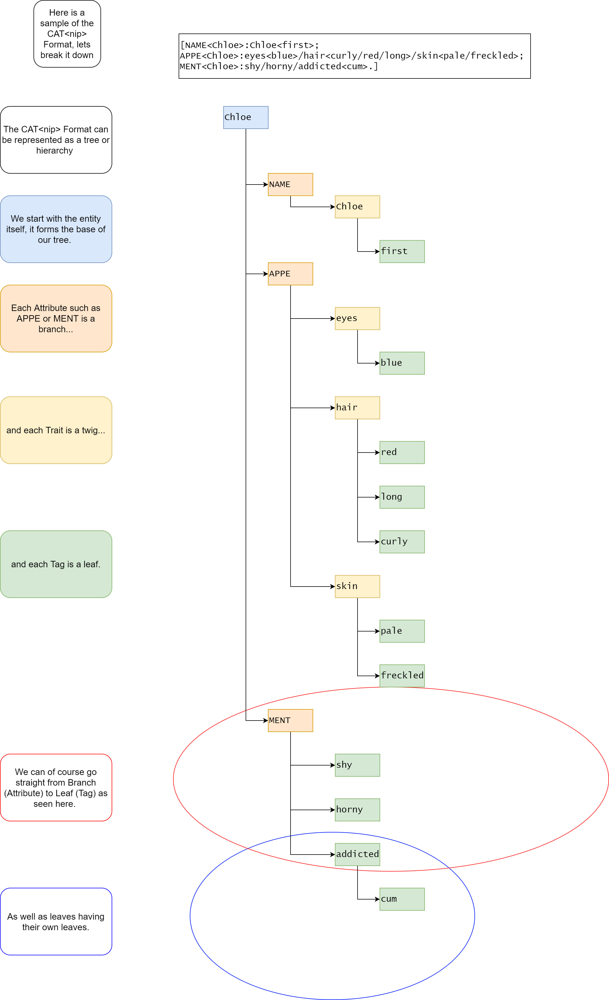

# CAT&lt;nip> Formater

This is a CAT&lt;nip> formating tool for AI Dungeon. This formating method was created by Curious Nekomimi. 

## What is CAT&lt;nip>
CAT&lt;nip> is a code format for entities in AI Dungeon. It allows AI dungeon to "rememeber" things about a character with greater accuracy. Below is a sample breakdown of CAT&lt;nip>.

## WIP
This code is a work in progress

## How to use it
Fill in the blanks with the information you want to convert into the CATNIP format, example below.

## Features to add

### Expand the potential inputs
Currently the formater only supports a limited number of inputs. Only one TRAIT can be supported per line, but traits can support multiple tags. 
### Add catches for bad data

### POLISH IT UP

### Export to apk
